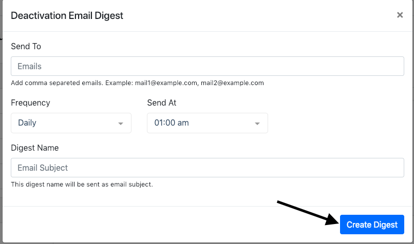

# Email Digest

To enable email digest go to <code> Email Digest </code> page and click on <code>Add New</code> button. After clicking on the <code>Add New</code> button you will get a form.

 
 
 ### Fill up the form with following information.
 
 <table>
     <tr>
         <th>Name</th>
         <th>Required</th>
         <th>Description</th>
     </tr>
     <tr>
         <td> Send To </td>
         <td> <code>Yes</code> </td>
         <td> Add comma separeted emails. Example: mail1@example.com, mail2@example.com. Digest will be send to those emails  </td>
     </tr>
     <tr>
         <td> Frequency </td>
         <td> <code>Yes</code> </td>
         <td> Frequency of the digest. It can be email Daily, Weekly or Monthly. </td>
     </tr>
     <tr>
         <td> Send On </td>
         <td> <code>Yes</code></td>
         <td> This is available only for Weekly and Monthly digest. For Monthly select date and for weekly select day.  </td>
     </tr>
     <tr>
         <td> Send At </td>
         <td> <code>Yes</code> </td>
         <td> The time when you would like to receive the digest. </td>
     </tr>
     <tr>
         <td> Digest Name </td>
         <td> <code>Yes</code> </td>
         <td> The name of the digest. This name will be send as Email subject </td>
     </tr>
 </table>
  

> After fill up the form click on <code>Create Digest</code> button 

Digest has been created successfully. You will get digest to provided emails according to Frequency.   