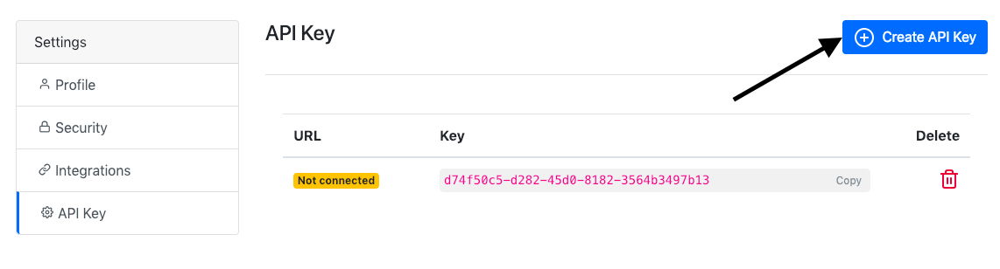
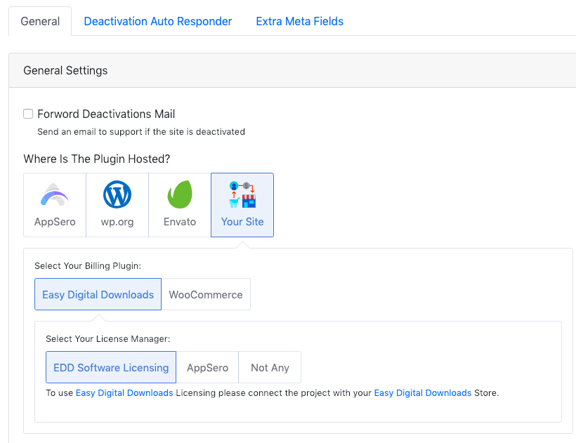
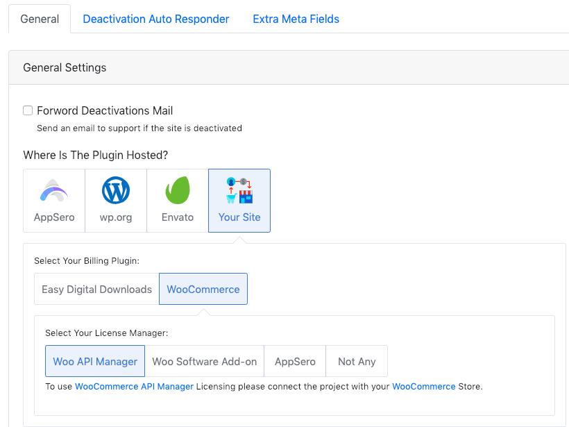
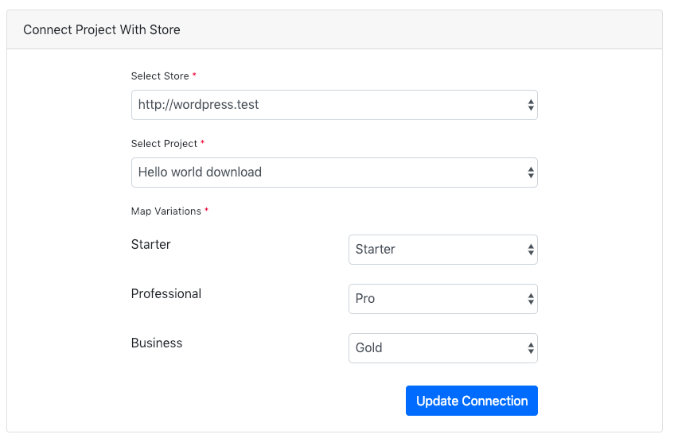
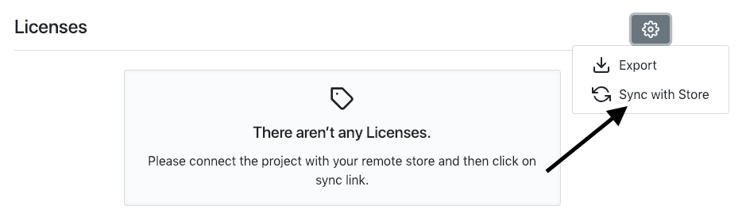

# Syncing license from your existing (EDD, Woo SA, Woo API) store:

- **To sync licenses from WordPress store follow the following steps**
    - [Creating API Key](#creating-api-key)
    - [Install AppSero Helper and connect using API Key](#install-appsero-helper)
    - [Enable licensing on AppSero](#enable-licensing)
    - [Connect AppSero Plugin/Theme with the Theme/Plugin on your wordpress store.](#connect-the-plugin-theme)
    - [Sync license with store on AppSero.](#sync-licenses)

### Creating API Key

To create <code>API Key</code> go to API Key page under right top navigation menu.

Then click on <code>Create API Key</code> button.

> API Key has been created. Use this API Key to connect your WordPress Site by AppSero Helper Plugin

## Install AppSero Helper

Go to your store WordPress site and install <code>AppSero Helper</code> plugin. To install AppSero Helper go to plugin page and search AppSero Helper and install the plugin. AppSero helper will ask for a <code>API Key</code> to connect with AppSero. Copy the <code>API Key</code> from AppSero and connect AppSero Helper plugin using the API Key. 

> Your Website is now connected with AppSero.

## Enable licensing

To sync license with your WordPress site at first enable licensing for the plugin/theme as well as select licence source. If enabled licensing at the time of creating project then don’t need to do anything. If not then go to <code>Settings</code> page and click on <code>Your Site</code> as hosted site of the plugin/theme. Select the plugin is used for billing. There are two option one is <code>Easy Digital Downloads</code> another one is <code>WooCommerce</code>.  

To sync with <code>EDD Software Licensing</code> select <code>Easy Digital Downloads</code> as your billing plugin and <code>EDD Software Licensing</code> as license manager. 

To sync with <code> WooCommerce API Manager</code> select <code>WooCommerce</code> as billing plugin and <code>Woo API Manager</code> as license manager. 
               
To sync with <code>WooCommerce Software Add-on</code> select <code>WooCommerce</code> as billing plugin and <code>Woo Software Add-on</code> as license manager. 

And finally click on **<code>Update Settings</code>** button.

> Licensing has been enabled for the Plugin/Theme

## Connect the Plugin/Theme

To connect Plugin/Theme go to <code>Integrations</code> Page. On <code>Connect Project With Store</code> box select the store from the select field. 
Select the project from the store’s available projects. Map project variations if the Plugin/Theme has multiple variations. 

And click on **<code>Update Connection</code>**

> Well done, Plugin/Theme has been mapped with store's Plugin/Theme.

## Sync licenses

To sync license with your WordPress store go to <code>Licenses</code> page and click on <code>Sync With Store</code> link under dropdown menu.

> Syncing will be started and you will get an email when syncing will be completed. 

