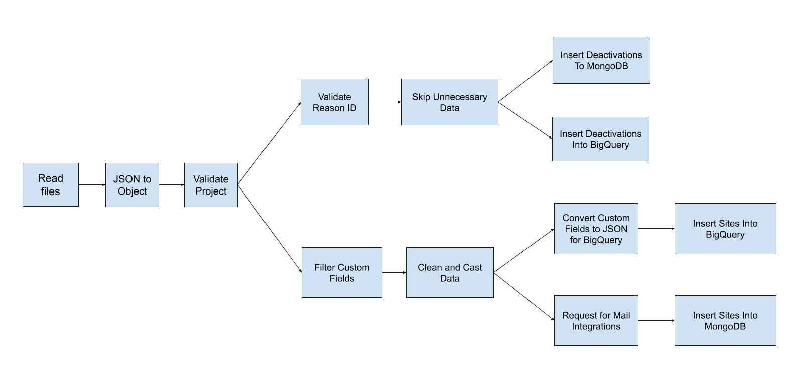

# Deactivate Data Pipeline Architecture

There are mainly 13 steps on this pipeline. The task of every step is as follows. 

## Read Files:
Read all JSON files of the previous hour from GCP cloud storage.

## JSON to Object:
This step just converts JSON to a Python dictionary for further execution.

## Validate Projects:
This step checks the hash, is the hash of a valid project or not. If the data is valid then send it to the next step otherwise skip it.

## Filter Custom Fields:
This step validates the custom fields of a project. If it found any valid custom fields then it creates an array of those custom fields. Send the array with other data to the next step.

## Clean and Cast Data:
Create a fresh array of data. This step cast data type for the necessary fields and just take the valid fields and skip unnecessary fields. After this step, we get a fresh and clean array of data.

## Request for mail integrations:
This checks the project on MongoDB. If the mail integration (MailChimp, MailJet, WeMail) is true then send a request to the appsero-api server for sending the mail to the provider list. If there is no mail integration then it doesn’t send any request. 

## Insert Sites Into MongoDB:
Insert the site into MongoDB if this is a new site. If the site already exists then it updates all information on the site. MongoDB database is used to store the latest data for each site. 

## Convert Custom Fields to JSON for BigQuery:
We are storing custom fields as a JSON string in BigQuery. This step converts the custom fields array to JSON string so that this can be inserted into BigQuery. 

## Insert Sites Into BigQuery:
Insert the site into BigQuery. We are using BigQuery as a data warehouse. We store all historical data of sites into BigQuery. 

## Validate Reason ID:
This step checks the reason id on MongoDB. Here reason_id is the slug of the deactivation reason. If the reason_id is valid then it sends the data to the next step otherwise skip the data.

## Skip Unnecessary Data:
This is step clean data for the deactivation table. This step removes unnecessary fields for the elements.

## Store Deactivation to MongoDB:
This step saves the latest deactivation to the MongoDB database. MongoDB database doesn’t contain historical data, deactivation just contains the latest deactivation of a site.

## Store Deactivation to BigQuery:
This step saves all deactivations to the BigQuery. BigQuery stores historical data of deactivations.
