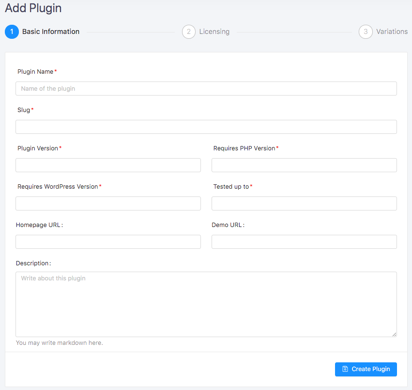
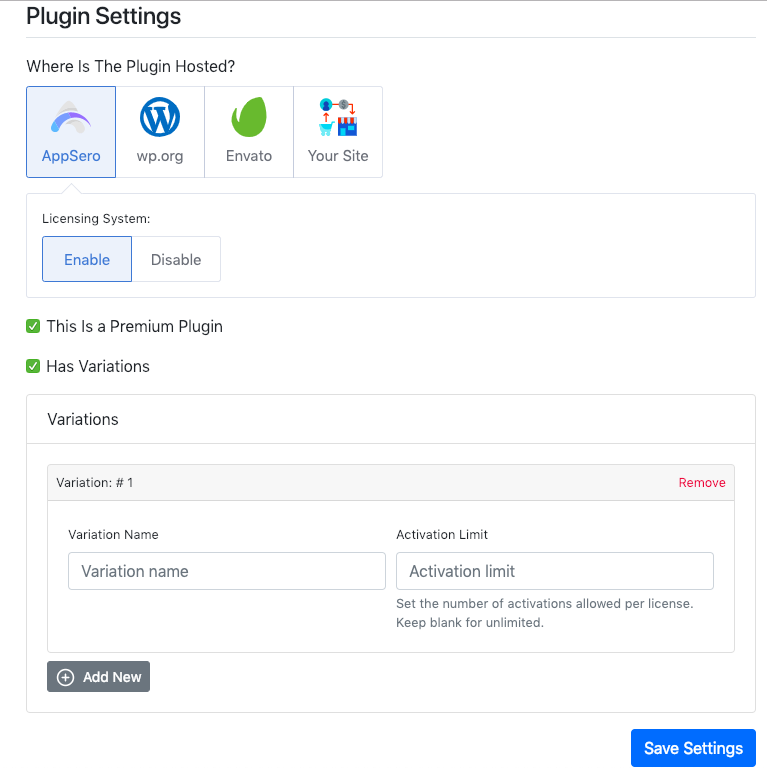

# Adding a Plugin

## Basic Information

To create new plugin go to <code>Plugins</code> menu then click on <code>Add Plugin</code> button. Fill up the form with the following information:

### Available Fields
<table>
    <tr>
        <th>Name</th>
        <th>Required</th>
        <th>Description</th>
    </tr>
    <tr>
        <td> Plugin Name </td>
        <td> <code>Yes</code> </td>
        <td> The name of the plugin. </td>
    </tr>
    <tr>
        <td> Slug </td>
        <td> <code>Yes</code> </td>
        <td> Slug of the plugin. It will be generated automatically but you can change it. Note that you will not be able to update it later. </td>
    </tr>
    <tr>
        <td>Version</td>
        <td><code>Yes</code></td>
        <td>The version of the plugin. You will be able to add new version at the time of release.</td>
    </tr>
    <tr>
        <td>Requires PHP Version </td>
        <td><code>Yes</code></td>
        <td>Requires PHP Version for the plugins.</td>
    </tr>
    <tr>
        <td>Requires WordPress Version </td>
        <td><code>Yes</code></td>
        <td>WordPress version requires for the plugin.</td>
    </tr>
    <tr>
        <td>Tested up to </td>
        <td><code>Yes</code></td>
        <td>Maximum version of WordPress the plugin has been tested.</td>
    </tr>
    <tr>
        <td>Homepage URL</td>
        <td><code>No</code></td>
        <td> Website URL of the plugin. Put Website URL based on the hosted store. Put WordPress.org URL of the plugin, if it is hosted on WordPress.org. </td>
    </tr>
    <tr>
        <td>Demo URL</td>
        <td><code>No</code></td>
        <td>Demo site URL of the plugin.</td>
    </tr>
    <tr>
        <td>Description</td>
        <td><code>No</code></td>
        <td>Give a description of the plugin. This field is markdown supported.</td>
    </tr>
</table>

 

After filling up the form click on <code>**Submit Plugin**</code> button. 

> Congratulations :tada: the plugin has been created. 
  Please update settings.

## Plugin Settings
After submitting the plugin it will be redirected to <code>Plugin Settings</code> page. On settings page update following information. 

### Where Is The Plugin Hosted
Select the plugin’s hosted site among **[AppSero](#appsero)**, **[WordPress.org](#wordpress-org)**, **[Envato](#envato)** and **[Your Site](#your-site)**. 

### AppSero
Select AppSero if the plugin hosted on appaero.com after that you will get an option to enable licencing. If you would like to manage licensing for this plugin then <code>Enable</code> licensing system otherwise <code>Disable</code> it. 

If this is a premium plugin then check on <code>This Is a Premium Plugin</code>. 

If enabled <code>This Is a Premium Plugin</code> then, you will get an option  for variation. If the plugin has multiple variations then check on <code>Has Variations</code> and add variations by providing <code>Variation Name</code> and <code>Activations limit.</code> 

### WordPress.org
Licensing is not available for the plugin hosted on WordPress.org.

### Envato
To enable licensing using Envato purchase key click on <code>Use Envato Purchase Code</code> button. If don’t need licensing then click <code>Not Using Any</code> button.  To use Envato licensing by purchase code you have to [connect](envato-licensing.md) this plugin with your Envato item. 

[Click Here To Learn More About Envato Licensing](envato-licensing.md) 

### Your Site
Select the plugin you are using for billing. There are two options one is <code>Easy Digital Downloads</code> another <code>WooCommerce.</code> 

#### Select your preferred license manager. 
For <code>Easy Digital Downloads</code> there are two options one <code>EDD Software Licencing</code> another <code>AppSero</code> native. Select your preferred licensing system. If the plugin doesn’t need licensing then click on <code>Not Any</code>. 

For <code>WooCommerce</code> there are three options <code>WooCommerce API Manager</code>, <code>WooCommerce Software Add-on</code>, <code>AppSero</code> Native Licensing. Select your preferred licensing system.  If the plugin doesn’t need licencing then click on <code>Not Any</code>. 
If this is a premium plugin then check on <code>This Is a Premium Plugin</code> checkbox. 

If enabled <code>This Is a Premium Plugin</code> then you will get an option  for variation. If the plugin has multiple variations then check on <code>Has Variations</code> and add variations by providing <code>Variations Name</code> and <code>Activations limit.</code> 
  

Finally, click on <code>**Save Settings**</code> button. 

> Congratulations, Plugin Settings have been Updated. :slightly_smiling_face: