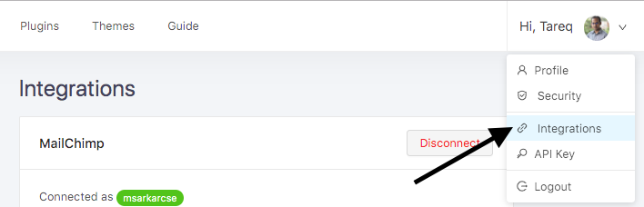
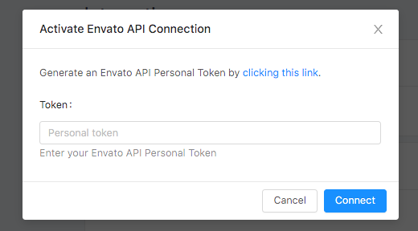
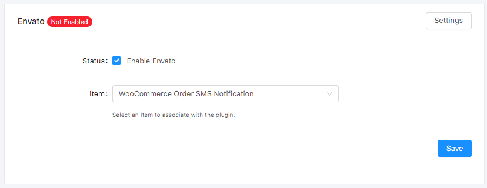

# Enable Licensing For Envato

- To enable licensing for Envato by Purchase code follow the following steps:
    - [Enable Envato Purchase Code licensing](#enable-licensing)
    - [Create an App on Envato](#create-envato-app)
    - [Integrate Envato with AppSero](#integrate-envato-with-appsero)
    - [Map the Plugin/Theme with Envato Project.](#map-the-plugin-theme-with-envato-project)

## Enable licensing

If enable <code>Envato Purchase Code Licensing</code> at the time of creating Plugin/Theme then don’t need to do anything in this step go to next step. But if not enabled then go to <code>Settings</code> page. Under <code>General Settings</code> select <code>Envato</code> as hosted site under <code> Where It Is Hosted </code> option and select <code>Use Envato Purchase Code</code> as licensing system.

## Create Envato App

To connect AppSero with Envato need a personal token. For a personal token need to [create](https://build.envato.com/create-token/?purchase:download=t&sale:verify=t&sale:history=t&user:account=t&user:username=t) an Envato app. To create app click on the link.
[Create Envato App](https://build.envato.com/create-token/?purchase:download=t&sale:verify=t&sale:history=t&user:account=t&user:username=t)

Give a name for your app and accept terms and conditions. Then click on <code>Create Token</code> button. You will get an token. Save your token.

## Integrate Envato with AppSero

To integrate Envato with AppSero go to <code>Integrations</code> page under right top navigation menu.  

On Integrations page connect envato by your Envato personal token.

> AppSero is connected with Envato. 

## Map the Plugin/Theme with Envato Project.

Go to <code>Integrations</code> page of Plugin/Theme. On <code>Envato</code> box click on Settings button. After clicking on <code>Settings</code> button you will get two options there click on <code>Enable Envato</code> and Select an item you want to map with this Plugin/Theme. 

Click on the **<code>Save</code>** button

> The Plugin/Theme has been mapped with Envato item.   
And licensing has been enabled