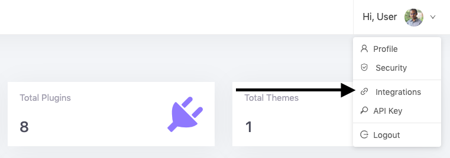
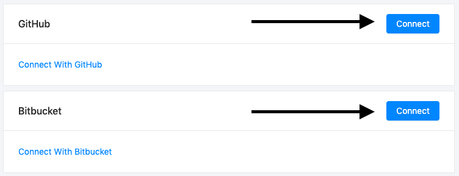
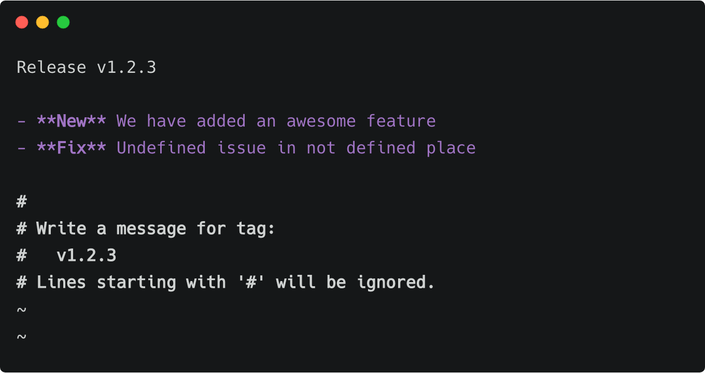

# Push to Deploy

Automatically release new version of your Plugin or Theme from GitHub or Bitbucket. Push your project tags to GitHub or Bitbucket to create a new release in Appsero and user will get automatic update from Appsero.

## Connect With GitHub or Bitbucket

To connect your profile with GitHub or Bitbucket go to `Integrations` page under top right navigation menu.



Then click on `Connect` button of your project Git repository manager.



Now go to your project `Integrations` page and select the repository for your Plugin or Theme.


## Install dependencies

To install dependencies your repository must contains both `composer.json` and `composer.lock` files. If these two files are present then **Appsero** will automatically run `composer install` for you.

## Remove Files or Folder From Production

Add a json file in root directory called `appsero.json` and add an array with `exclude` key.

```json
{
    "exclude": [
        "README.md",
        "appsero.json",
        "composer.json",
        "composer.lock",
        ".gitignore",
        "assets/src"
    ]
}
```

## Custom Directory Name

By default we use project slug for your Plugin or Theme directory name, But you have option to change it. Add directory name with key `name` in `appsero.json` file. 

```json
{
    "name": "push-to-deploy"
}
```

## Changelog

Add changelog in tag message. Don't add `-m` flag in your tag command. Please look at the example below.

```
$ git tag -a "v1.2.3"
```



> A success or failed email will send to your email address after processing the project files.
