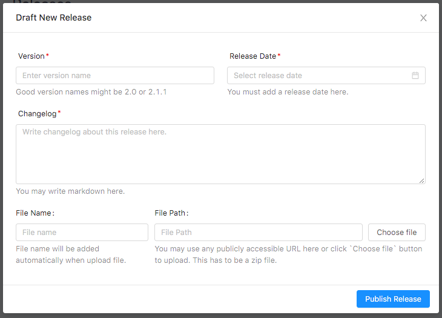

# Release

 

<iframe width="100%" height="400" src="https://www.youtube.com/embed/4-VqC2COQvo" frameborder="0" allow="accelerometer; autoplay; encrypted-media; gyroscope; picture-in-picture" allowfullscreen></iframe>

 
 

To publish new release go to <code> Releases </code> page and click on <code>Add New Release</code> button. After clicking on the <code>Add New Release</code> button, you will get a form.

 
 
 ### Fill up the form with the following information.
 
 <table>
     <tr>
         <th>Name</th>
         <th>Required</th>
         <th>Description</th>
     </tr>
     <tr>
         <td> Version </td>
         <td> <code>Yes</code> </td>
         <td> The version of the release </td>
     </tr>
     <tr>
         <td> Release Date </td>
         <td> <code>Yes</code> </td>
         <td> Date of Release </td>
     </tr>
     <tr>
         <td> Changelog </td>
         <td> <code>Yes</code></td>
         <td> Change log of the Plugin/Theme. This is markdown supported. </td>
     </tr>
     <tr>
         <td> File Name </td>
         <td> <code>Yes</code> </td>
         <td> Name of the file. It will be filled up automatically if you upload the file. </td>
     </tr>
     <tr>
         <td> File Path </td>
         <td> <code>Yes</code> </td>
         <td> File location path of the file. It will be filled up automatically if you upload the file.</td>
     </tr>
 </table>
  

If the Plugin/Theme has multiple variations then you will get multiple options for publishing release.  

> After filling up the form, click on <code>Publish Release</code> button 

The release has been created successfully. Your customer will get a notification for the update and will be able to update the Plugin/Theme.