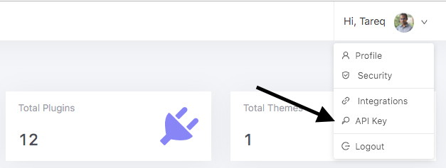
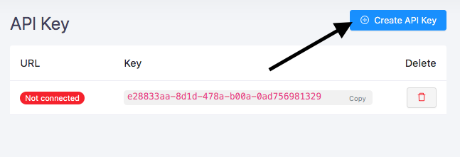
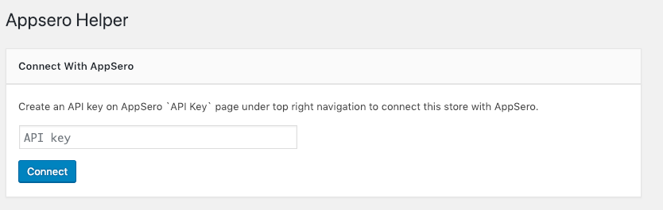
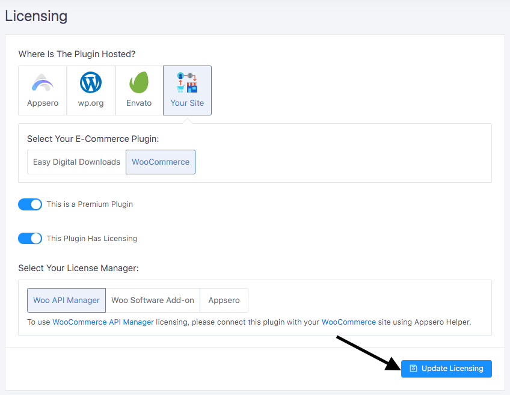
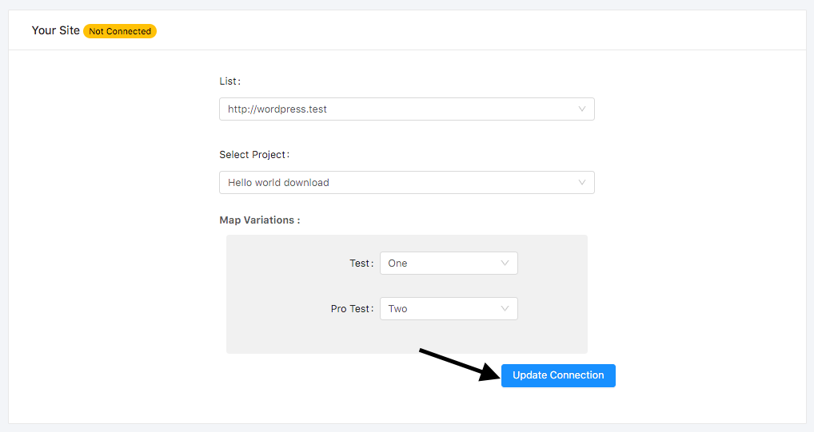
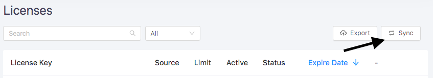

# Syncing Licenses From WordPress Store:

- **To Sync Licenses From WordPress Store Follow the Following Steps:**
    - [Creating API Key](#creating-api-key)
    - [Install Appsero Helper](#install-appsero-helper)
    - [Enable Licensing](#enable-licensing)
    - [Map the Plugin/Theme](#connect-the-plugin-theme)
    - [Sync Licenses](#sync-licenses)

## Creating API Key

To create `API Key` go to the API Key page under right top navigation menu.

Then click on `Create API Key` button.

> API Key have been created. Use this API Key to connect your WordPress Site by Appsero Helper Plugin

## Install Appsero Helper

Appsero Helper provides a connection between Appsero and WordPress store.

Go to your store WordPress site and install `Appsero Helper` plugin. To install `appsero-helper` upload the `appsero-helper` plugin to your `/wp-content/plugins/` directory. Or go to the plugin page and search `Appsero Helper` and install and activate the plugin. When installation will be completed it will ask for a `API Key` to connect with Appsero.
 
 
 
 Copy `API Key` from Appsero. If don't have any `API Key` then [create new API Key](/). Copy the Key and paste it to API Key input box then click on `Connect` button.
 
 ::: tip
 After completing installation if it doesn't redirect to `Appsero Helper` page then go to `Settings > Appsero Helper`. And connect the Helper.
 :::

> Your Website is now connected with Appsero.

## Enable licensing

To sync license with your WordPress site at first enable licensing for the plugin/theme as well as select license source. If enabled licensing at the time of creating the project then don’t need to do anything. If not then go to `Settings` page and select `Your Site` as hosted site of the plugin/theme. Select the plugin is used for billing. There are two option one is `Easy Digital Downloads` another one is `WooCommerce`.  

To sync with `EDD Software Licensing` select `Easy Digital Downloads` as your billing plugin and `EDD Software Licensing` as license manager. 

To sync with ` WooCommerce API Manager` select `WooCommerce` as billing plugin and `Woo API Manager` as license manager. 
               
To sync with `WooCommerce Software Add-on` select `WooCommerce` as billing plugin and `Woo Software Add-on` as license manager. 

And finally, click on **`Update Settings`** button.

> Licensing have been enabled for the Plugin/Theme

## Connect the Plugin/Theme

To connect Plugin/Theme go to `Integrations` Page. On `Connect Project With Store` box select the store from the select field. 
Select the project from the store’s available projects. Map project variations if the Plugin/Theme has multiple variations. 

And click on **`Update Connection`**

> Well done, Plugin/Theme has been mapped with store's Plugin/Theme.

## Sync licenses

To sync license with your WordPress store go to `Licenses` page and click on `Sync With Store` link under dropdown menu.

> Syncing will be started and you will get an email when syncing will be completed. 

